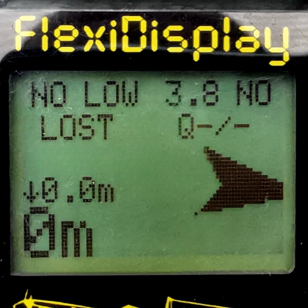
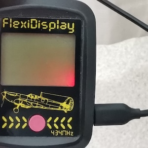
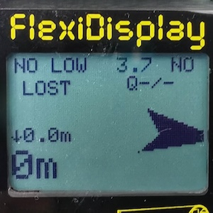
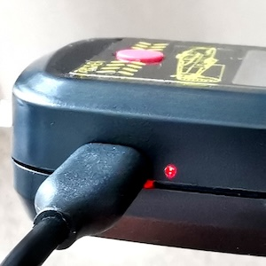
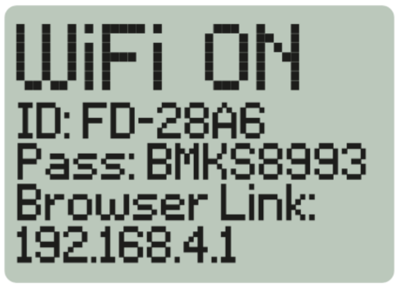
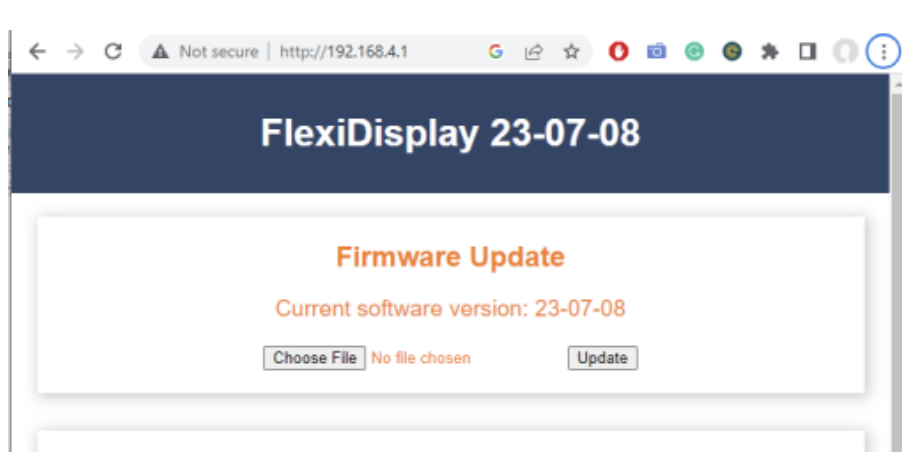

# FlexiDisplay Firmware Releases
Repository for the available FlexiDisplay Firmwares

Please note that it is crucial to use the correct firmware version
for your specific device to ensure compatibility and successful
firmware update.

## 1. Know your FlexiDisplay model

### NOKIA DISPLAY
The legacy Nokia displays have been used from day one until March 20, 2024.  
The charging indicator Red LED is part of the display backlight and visible from the front. 
These displays have rubber contacts that need perfect alignment and are sensitive to impacts.  

### ST7567 DISPLAY
Used on FlexiDisplay mainboards since March 20, 2024  
The charging indicator Red LED is not part of the display backlight and is moved next to the USB port. 
These displays have solderable contacts. 

## 2.Download the right firmware for your FlexiDisplay

### with NOKIA DISPLAY
- [FlexiDisplay_Legacy_NOKIA_Display_Latest_Firmware.bin](https://github.com/melihkarakelle/FlexiDisplay-Firmware-Releases/raw/main/With_Legacy_Nokia_Display/FlexiDisplay_Legacy_NOKIA_Display_Latest_Firmware.bin)

### with ST7567 DISPLAY
- [FlexiDisplay_ST7567_Display_Latest_Firmware.bin](https://github.com/melihkarakelle/FlexiDisplay-Firmware-Releases/raw/main/With_ST7567_Display/FlexiDisplay_ST7567_Display_Latest_Firmware.bin)

## 3. Switch your FlexiDisplay to the WiFi mode
Select WiFi from the Settings menu 

## 4. Connect with your computer
- On your phone, tablet, or computer, search for WiFi networks and look
for the network ID starting with "FD-".
- Connect to the network using the provided password, which typically
starts with "BMKS".

## 5. Open the configuration window by using your web browser
- Once connected, open a web browser and type "[192.168.4.1](https://192.168.4.1)" into the
address bar. This will take you to the web-based menu.

## 6. Upload the New Firmware
- choose the previously downloaded firmware .bin file from your computer/phone/tablet
- Press the upload button and you can follow the update process from the FlexiDisplay's display.
- It will restart automatically after the update.

     

# Version History:
* v2.0  
  * Magnetic Deviation calibration added to the Settings.
  * Compass Arrow code updated
  * ST7567 Display support added for the newer FlexiDisplays
